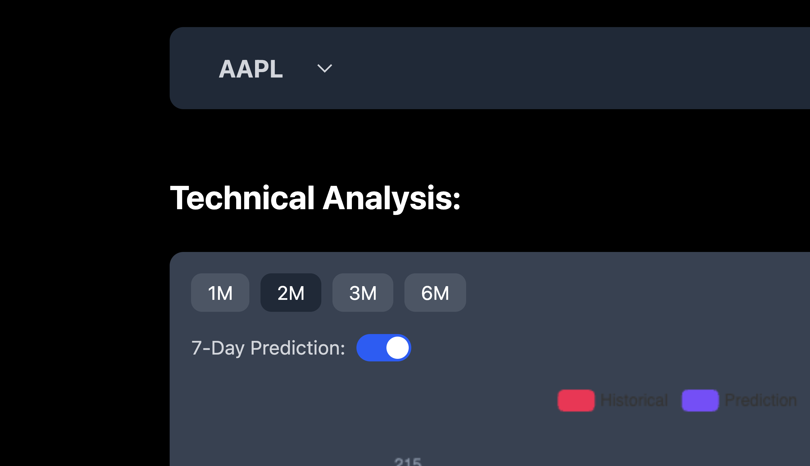
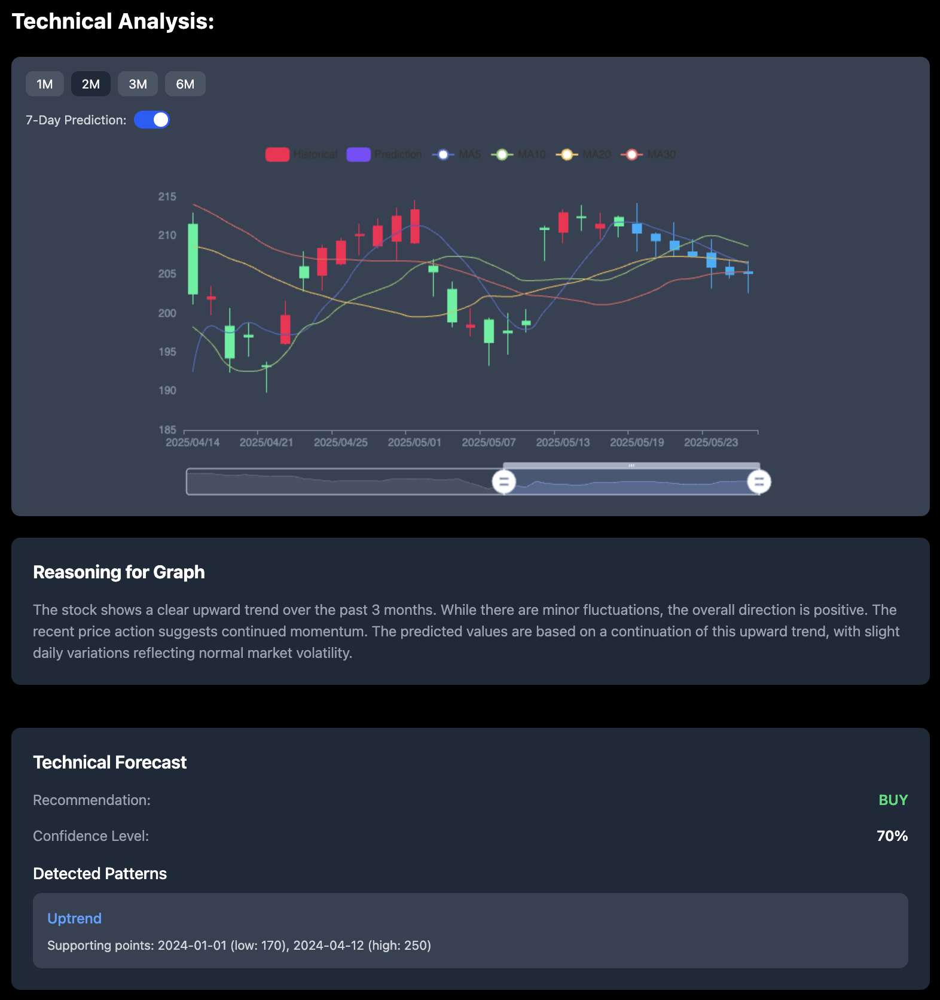
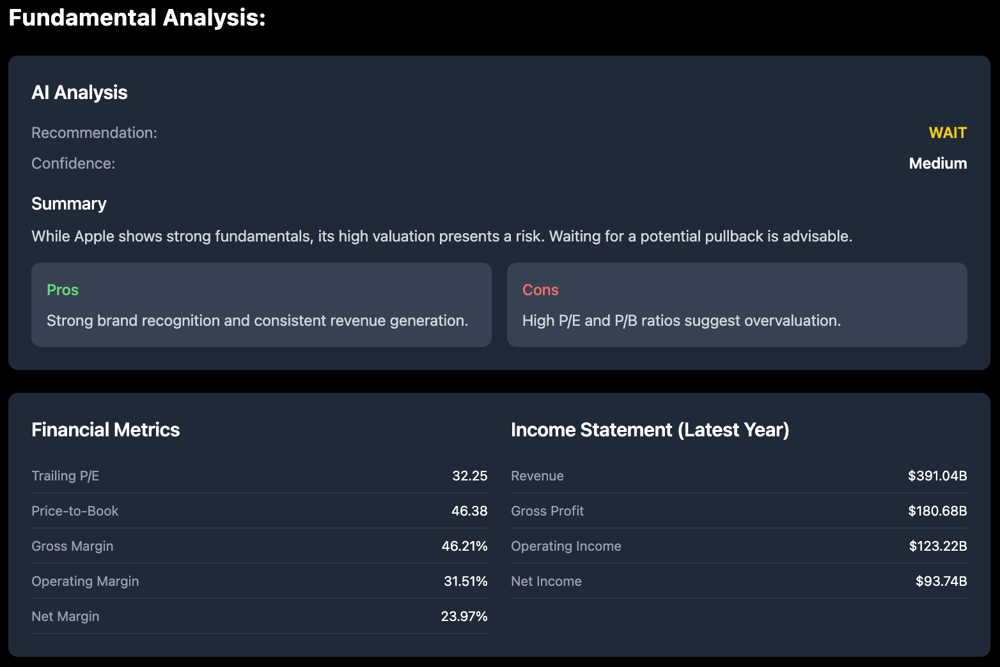
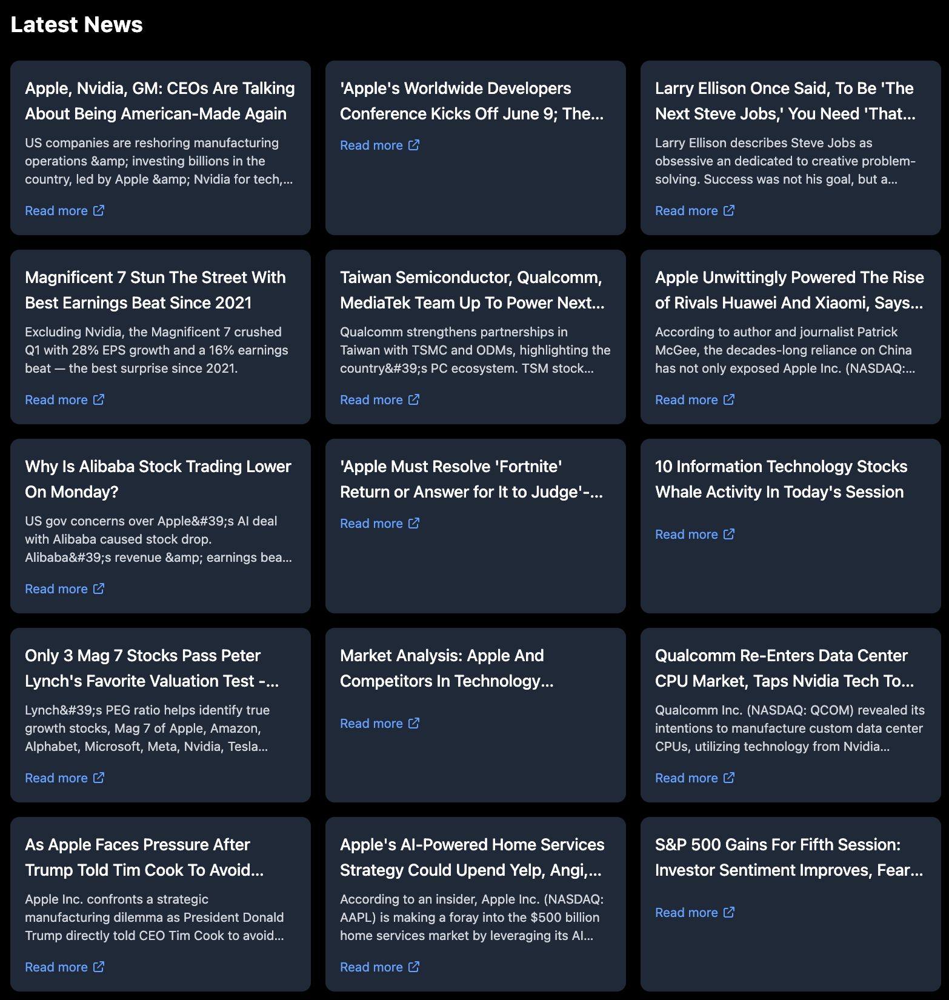

# 🐦 Pelican Predict

**Pelican Predict** is an intelligent stock analysis web app built during **Makeathon 2025**, a hackathon organized by **TUM.ai** from **April 25–27, 2025**, with **OpenAI** as the challenge giver.

Pelican Predict empowers users with **AI-enhanced stock analysis**, combining real-time data, LLM-generated insights, and sleek visualizations. Currently supports:  
**AAPL (Apple), NVDA (NVIDIA), TSLA (Tesla)**

---

## 🔍 Features

### ✅ Supported Tickers

Pelican Predict currently supports:
- **AAPL**
- **NVDA**
- **TSLA**

---

### 📈 Technical Analysis

- Real-time price charts
- Moving averages
- Technical indicators
- LLM-generated reasoning
- AI-powered stock prediction

---

### 📊 Fundamental Analysis

- Financial statements (income, balance sheet, cash flow)
- Financial ratios & metrics
- LLM-generated breakdown of fundamental health

---

### 📰 News Integration

- Real-time financial news for each stock
- LLM highlights correlations between news and stock movements

---

## 🤖 AI-Powered Insights

Pelican Predict uses a Large Language Model (LLM) to:
- Explain trends in charts and indicators
- Generate predictive insights
- Perform textual fundamental analysis
- Relate news headlines to market impact

---

## 🛠️ Tech Stack

- **Frontend**: React + TypeScript
- **Backend**: Python + FastAPI
- **Database**: MongoDB
- **AI**: OpenAI LLMs for reasoning, prediction, and analysis

---

## 👥 Built By

Made with ❤️ by:

- [@jsnthung](https://github.com/jsnthung)
- [@Feguna-1103](https://github.com/Feguna-1103)
- [@gregoriusnico](https://github.com/gregoriusnico)
- [@raymondkings](https://github.com/raymondkings)

During [**Makeathon 2025**](https://makeathon.tum-ai.com/)   hosted by **TUM.ai**
🧠 Challenge by: **OpenAI**

---

## ⚠️ Disclaimer

The information, analysis, and predictions provided by Pelican Predict are for **educational and informational purposes only**.  
They do **not constitute financial advice** and are **not recommendations to buy or sell any securities**.  
Always consult with a licensed financial advisor before making investment decisions.

---

## 📬 Contact

For feedback or collaboration, feel free to open an issue or reach out via GitHub.
